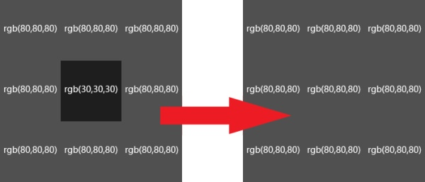
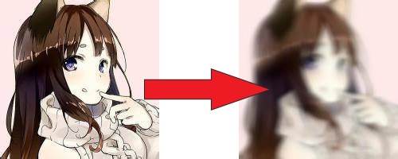
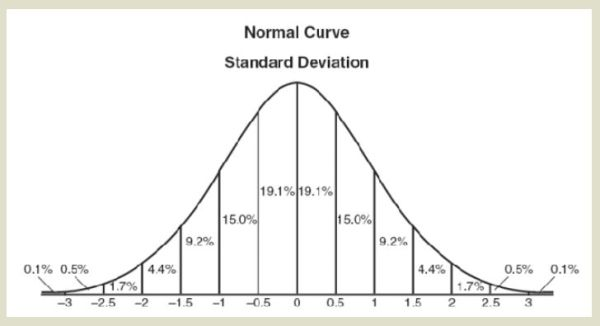
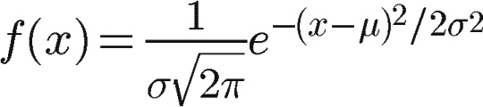
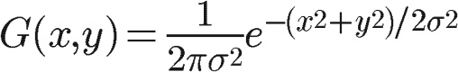
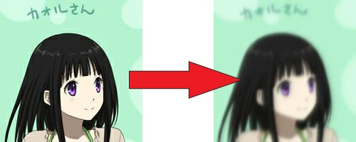

# Gaussian Blur 高斯模糊算法解析

文章链接：[Python 图像模糊入门（1）手写一个高斯模糊](https://zhuanlan.zhihu.com/p/43907816)

## 一、模糊

图片的模糊，一直是图像处理领域一个比较重要的东西，它的用处不仅仅是我们平时PS的滤镜，也常常被用来做图片数据的降噪，
图片的有损压缩，和图片特征相似匹配（详情可参见sift）的优化工作过程。而图片模糊的原理也非常简单：

`python blur.py`

效果如图:

## 二、高斯模糊

模糊半径外部与内部的差距非常巨大的时候，你会发现，上面这种方法的模糊效果非常的差，这种情况下，我们需要计算像素的权重，靠近中心的像素对于中心点来说关联性更强更重要，所以理应权重更高。

 

这种情况正好符合正态分布特点，所以选用正态分布来计算权重是一个较优的选择。

 

 

公式如下（详情可参见文章）

 

 

 

效果如图，模糊效果比rgb平均值更加的平滑了。

## 后续可以继续尝试
- 高性能的高斯模糊（如今一张小图也需要10秒以上）
- 高斯模糊的近似

