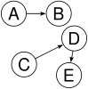
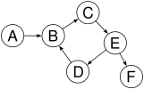

# Binary tree
树结构在数据结构中，作为非常常用的结构，是链表结构的衍生，可以清晰的表达父子关系、兄弟关系。层层展开的项目目录是树结构，环环嵌套的网页dom 也是树结构...

## 树结构的特点
- 始于一个根节点 root
- 每一个节点都包含了值
- 节点可能有一个或者多个的子节点引用
- 树结构的节点引用不会出现重复（即不会出现循环链表）
  
以下为一个树结构（无序），2 为 root 节点，并且有两个子节点 7 和 5 ：


以下不能作为树结构的例子：  
  
  
  

以上这种，每个节点的子节点个数不超过 2 个的情况，我们又称为二叉树。注意，本例子讲解的树结构只从二叉树出发。

## 树节点实现
```javascript
class Node {
  constructor(val){
    this.left = null;
    this.right = null;
    this.val = val;
  }
}
```

只要将节点按照链表方式一一嵌套，那么一颗无序二叉树就生成了。

## 二叉搜索树 Binary search tree
这时，我们遇到了一个问题，无序二叉树的节点难以查找，为了找到一个节点，你只能使用遍历的方法，一一查找，时间复杂度 O(n)。这个时候二叉搜索树就出现了。为了方便查找，我们给每一个节点带上序号，并且按照大的数在左，小的数在右的方式向下延伸，
了解过二分查找的同学们应该就明白了，这就好比，买了很多书，过机的时候有一本忘了付钱，这时候只需每次取出书堆的一半，
按批分别过机，每次都为上次的一半，这样的时间复杂度就降为了 O(log(n)) 效率就大大提高了。如图：


## 构建二叉搜索树
```javascript
class Tree {
  insertNode(parent,val){
    // parent is the node to start from
    // val is where the node current placed
    if(val < parent.value) {
      // if isset left node
      if(parent.left) {
        this.insertNode(parent.left,val);
      } else {
         parent.left = new Node(val);
      }
    } else {
      if(parent.right) {
        this.insertNode(parent.right,val);
      } else {
        parent.right = new Node(val);
      }
    }
  }
}
```

## 树结构的衍生
- [红黑树](./red-black-tree/README.md) 假如二叉树不平衡的时候，二分查找就失去了意义...
 


