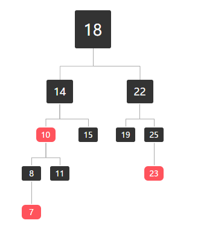
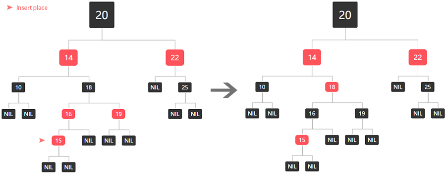
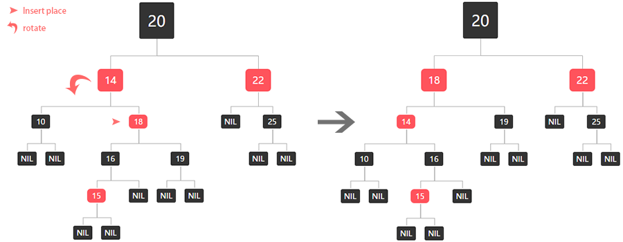
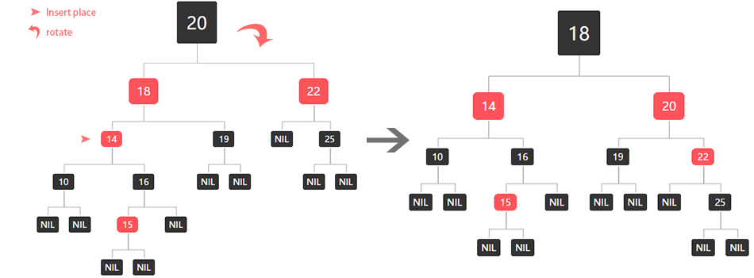

# 红黑树 red black tree
只以大小为分界的话，如果出现树的左分支错综复杂，而右分支只是寥寥几个值，对于二分查找的查找效率最坏会降低到 O(n)
也就是说任然还是等同于遍历，二分查找就失去了意义。这个时候，红黑树就出现了，红黑树是在之前二叉搜索树的基础上，每一个节点都增加一个空位，
这个空位通常被解释为这个节点的颜色。

## 红黑树定下的规则：
在二叉搜索树的前提下，还必须满足：
1. 每一个节点都是红色或者黑色
2. 根是黑色的
3. 所有叶子节点（节点不存在子节点或者为空节点被称作叶子节点）都是黑色的
4. 每个红色节点必须有两个黑色的子节点。（所有路径不会出现连续的红色节点）
5. 从给定节点到其后代叶子节点的每一条路径都包含相同数量的黑色节点，且没有一条路径会是别的路径长度的两倍  


> 由以上特征你可以发现，红黑树红色节点后不会出现单独的黑色节点结尾（违反规则四），但黑色节点后单独红色
节点结尾任然成立，因为空节点（即叶子节点）为黑色。

这些颜色用于确保树在插入和删除期间整体树结构保持近似平衡，用来稳定二分查找的效率。  
## 红黑树的左旋和右旋
要完成红黑树的添加与删除，又不予以上的五条性质有冲突，每一次插入或者删除，都要重新编排和着色。为了要保证不破坏二叉树原有的大的数在左，小的数在右的性质。
那么任意移动位置显然是不行的，所以很多操作都由左旋和右旋进行代替了。

### 左旋：
左旋就是将原本的右侧子节点作为父节点，左旋就意味着将旋转的节点变成了左节点。

x 节点左旋简单示意图：
```
                      z
   x                 /                  
  / \      --->     x
 y   z             /
                  y
```

### 右旋：
右旋旋就是将原本的右侧子节点作为父节点，右旋就意味着将旋转的节点变成了右节点。

x 节点右旋简单示意图：
```
                   y
   x                \                  
  / \      --->      x
 y   z                \ 
                       z
```

当然，这只是简单的情况。

## 红黑树是如何插入节点并保持平衡的？
首先，我们将插入的节点初始为红色（为了不违反第五条规则），并当做子节点按照二叉树的方法插入该节点。
由于第四条规则规定（红色节点的子节点必须是黑色），所以我们根据被插入的父节点的不同情况分为以下三种情况来处理：

| 父节点 | 处理办法
|---|---|
是根节点（root）| 把节点变成黑色
是黑色节点 | 无需改变，插入后任是红黑树 
是红色节点 | 特殊处理

### 父节点为红色节点
这种情况下，父节点必然存在一个祖父节点（父节点的父节点），也一定存在叔叔节点（父节点的兄弟节点）。即使叔叔节点
为空，我们也认定他存在，空节点算是一个黑色节点，当前父节点为红色，根据当前父节点的兄弟节点又分为以下三种情况：
1. 叔叔节点是红色
   - 将当前父节点设为黑色
   - 将叔叔节点设为黑色
   - 将祖父节点设为红色，并且将祖父节点设置为新的当前节点，进行下一步分析

如图所示：


2. 叔叔节点是黑色的，当前节点是右节点
   - 将父节点作为新的当前节点
   - 以新的当前节点为支点进行左旋
   
如图所示：


3. 叔叔节点是黑色的，当且节点是左节点
   - 将父节点设置为黑色
   - 将祖父节点设置为红色
   - 以祖父节点为支点进行右旋
   
如图所示：



## 总结
相近似的操作同样出现在删除节点之中，在此就不一一赘述。
红黑树的变换就好像拧魔方的公式一样，根据不同的情况找一种方法进行平衡。
至于更深层次的数理或许需要继续研究。

### 参考文档
- 《算法导论》
- [维基百科](https://en.wikipedia.org/wiki/Red%E2%80%93black_tree)
- [可视化黑红树的例子](https://www.cs.usfca.edu/~galles/visualization/RedBlack.html)
