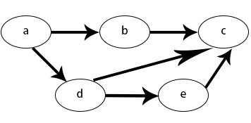
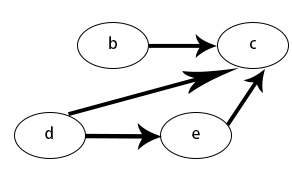

# 拓扑排序 (Topological sorting)
某校的选课系统规定，每门课可能有若干个先修课，如果要修读某一门课程，则必须要先
修完所有的先修课才能修读。假设一个学生同时只能报一门课程，那么选课系统允许他修完所有课程的顺序就是一个拓扑序...

从上述小例子中可以看出，拓扑排序是一个有效的任务顺序，每一门课对应有向图的一个顶点，
先修关系对应有向图的一条边。

## 有向无环图 (DAG)
在图论中，有向图用边（直线）描述结点（圆）与结点之间的方向关系，
如果一个有向图从任意顶点出发无法经过若干条边回到这个点，则称这个图是一个有向无环图。如图所示：


### 拓扑排序
有向无环图（DAG）才有拓扑排序，非 DAG 图没有拓扑排序。
当有向无环图满足以下条件时：

1. 每一个顶点出现且只出现一次
2. 若A在序列中排在B的前面，则在图中不存在从B到A的路径。



我们称这样的图，是一个拓扑排序的图。与之前的树结构对比不难发现，树结构其实可以转化为拓扑排序，而拓扑排序
不一定能够转化为树。

## 拓扑排序的序列 (Kahn's algorithm)
就以上面的拓扑排序为例。在程序中如何表达这一关系呢。  
常见的方式如下：
1. 分别表达结点和边
   - [a,b,c,d,e]
   - [(a,b),(a,d),(b,c),(d,c),(d,e),(e,c)]

2. 用一个字典表示图结构
 ```Python
 graph = {
     "a": ["b","d"],
     "b": ["c"],
     "d": ["e","c"],
     "e": ["c"],
     "c": [],
 }
```
那么，我们究竟要从怎么样依次选择 “先修课” 呢？大多数情况，选课可以有许多种方案，也就
意味着图中有多个拓扑排序，我们每一次都选择已经没有前置课程的课程去上，以此类推，我们就会
得到其中的一种方案。

在算法中，每次都选择没有前置课的操作叫做，选取入度为 0 的结点加入拓扑队列。由于选过的课
就算完成了前置，所以选择过后还要删除当前点和与之相关的所有边。



### 代码实现
```Python
graph = {
    "a": ["b","d"],
    "b": ["c"],
    "d": ["e","c"],
    "e": ["c"],
    "c": [],
}

def TopologicalSort(graph):
  degrees = dict((u, 0) for u in graph)
  for u in graph:
      for v in graph[u]:
          degrees[v] += 1
  #入度为0的插入队列
  queue = [u for u in graph if degrees[u] == 0]
  res = []
  while queue:
      u = queue.pop()
      res.append(u)
      for v in graph[u]:
      	  # 移除边，即将当前元素相关元素的入度-1
          degrees[v] -= 1
          if degrees[v] == 0:
              queue.append(v)
  return res

print(TopologicalSort(graph)) # ['a', 'd', 'e', 'b', 'c']
```

## 参考文档
[Topological_sorting wiki](https://en.wikipedia.org/wiki/Topological_sorting)

